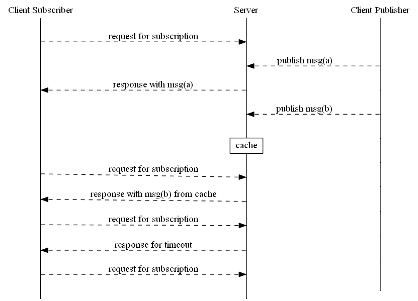

Comet (programming) 
======================
Commet技术，是2000年左右诞生的基于HTTP长连接，服务器向客户端（浏览器）推送数据的一种技术。
目前，websocket技术为此类问题的最优解决方案，C# 也有SignalIR专门用于解决服务器主动向客户端主动推送的问题。

* 订阅客户端发送订阅请求，发布客户端推送信息，服务器将推送信息转发至订阅客户端
* 订阅客户端未发起订阅请求，发布客户端推送消息，服务器将消息缓存，带订阅客户端订阅请求到来时转发给订阅客户端
* 订阅客户端订阅请求超时，仍未有新消息推送，则服务器返回超时

### 实现

* 客户端初始化，分配一个缓存消息队列
* 接收订阅请求后，异步启动遍历消息队列线程循环检查缓存消息队列中是否有消息和是否超时，有消息或超时则返回异步应答订阅请求
* 发布过程即投递至缓存消息队列中

### 优化
* HTTP 请求和应答采取异步
* 使用独立线程池或者与http服务器请求应答处理线程公用线程池
* 消息队列采用NoSQL数据库缓存

### 参考

* comet C#实现
  + [第一部分](https://www.codeproject.com/Articles/27107/Scalable-COMET-Combined-with-ASP-NET)
  + [第二部分](https://www.codeproject.com/Articles/27699/Scalable-COMET-Combined-with-ASP-NET-Part)
* [分享一些Comet开发经验](http://www.cnblogs.com/zc22/archive/2009/11/14/1603141.html)
