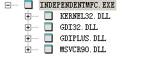

可单独使用的MFC基础类
==========================
从visual C++.NET 2002(VC 7.0)开始，一些存在于MFC的基础类被重写和修订，削减了与
其他MFC类之间的关系。这些类库可以独立被用于任何的native C++工程。

## 类 ##
* CFileTime
* CFileTimeSpan
* CFixedStringT
* CImage
* COleDateTime
* COleDateTimeSpan
* CPoint
* CRect
* CSimpleStringT
* CSize
* CStrBufT
* CStringData
* CStringT
* CTime
* CTimeSpan
* IAtlStringMgr

<pre data-language="C">
CSimpleStringT
 |
 +--CStringT
     |
     +--CFixedStringT
</pre>

## 测试代码 ##

### 例子 ###
[https://github.com/codepongo/utocode/tree/master/windows/independentmfc](https://github.com/codepongo/utocode/tree/master/windows/independentmfc)

<pre data-language="C">
int 
main(int argc, char* argv[])
{
	/* string */
	CStringT< char, StrTraitATL< char, ChTraitsCRT< char > > > str;
	str = "hi";
	str += ",independent MFC!\n";
	printf(str);

	/* point size rect */
	CPoint pt;
	CRect rc;
	CSize sz;
	rc.left = rc.top = 0;
	rc.right = rc.bottom = 100;
	sz = rc.Size();
	pt.x = 10;
	pt.y = 10;
	printf("rect(%d, %d, %d, %d):(%d,%d) move (%d, %d)\n",
		rc.left, rc.top, rc.right, rc.bottom, sz.cx, sz.cy, pt.x, pt.y);

	/* time */
	CTime tms;
	CTime tm;
	str.Format("%04d-%02d-%02d %02d:%02d:%02d\n",
		tms.GetYear(), tms.GetMonth(), tms.GetDay(), tm.GetHour(), tm.GetMinute(), tm.GetSecond());
	printf(str);

	CFileTime ft;
	CFileTimeSpan fts;
	COleDateTime dt;
	COleDateTimeSpan dts;

	str.Format("%lld\n", ft.GetTime());
	printf(str);

	/* image */
	CImage image;
	image.Load(L"image.png");
	str.Format("width:%d height%d\n", image.GetWidth(), image.GetHeight());
	printf(str);

	system("pause");
	return 0;
}
</pre>

## 参考 ##
[ATL/MFC Shared Classes](http://msdn.microsoft.com/en-us/library/ekdt199a.aspx)

[Classes Shared by MFC and ATL](http://msdn.microsoft.com/en-us/library/zzs00fs6.aspx)

[MFC Hierarchy Chart](http://msdn.microsoft.com/en-us/library/ws8s10w4.aspx)

[CString模板结构解析](http://blog.csdn.net/lvan100/article/details/7611646)
