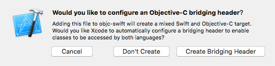
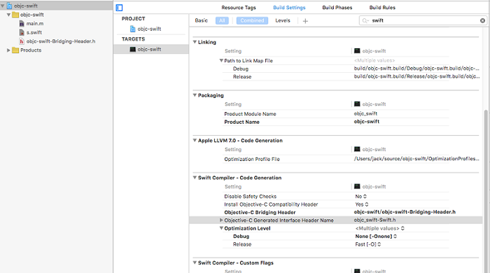

Swift 和 Objective-C 互相调用
==============================
## Objective-C 调用 Swift ##
### Swift 类 ###
Swift类定义前加入@objc关键字，并使类继承自NSObject

<pre data-language="swift">
@objc class S : NSObject{
    func m() {
        print(__FUNCTION__)
    }
}
</pre>

### 在调用Swift代码的Objc文件中加入名类似为"xxx-Swift.h"的头文件 ###

头文件具体的名字可在 设置选项：

> {project} - {targets} - {build settings} - {swift compiler - code generation} - {Objective-C Generated Interface Header Name}

<pre data-language="swift">

 #import "objc_swift-Swift.h"
int main(int argc, const char * argv[]) {
   @autoreleasepool {
        S* s = [[S alloc]init];
        [s m];
    }
    return 0;
 }
</pre>

## Swift 调用 Objective-C ##
### 创建桥接文件 ###

选择Create Bridging Header

### 桥接文件在如下设置位置 ###

> {project} - {targets} - {build settings} - {swift compiler - code generation} - {Objective-C Bridging Header}

### 将要调用的ObjC类头文件import至桥接文件中 ###

<pre data-language="objc">
//
//  Use this file to import your target's public headers that you would like to expose to Swift.
//

 #import "O.h"
</pre>

### ObjC 代码 ###
.h 文件

<pre data-language="objc">
@interface O : NSObject
-(void)m;
@end
</pre>

.m 文件

<pre data-language="objc">
@implementation O
-(void)m {
    NSLog(@"%s", __FUNCTION__);
}
@end
</pre>

swift 文件

<pre data-language="swift">
@objc class S : NSObject{
    let o:O = O()
    func m() {
        o.m()
        print(__FUNCTION__)
    }
}
</pre>

## 示例工程 ##
[objc-swift](https://github.com/codepongo/utocode/xos/objc-swift)

